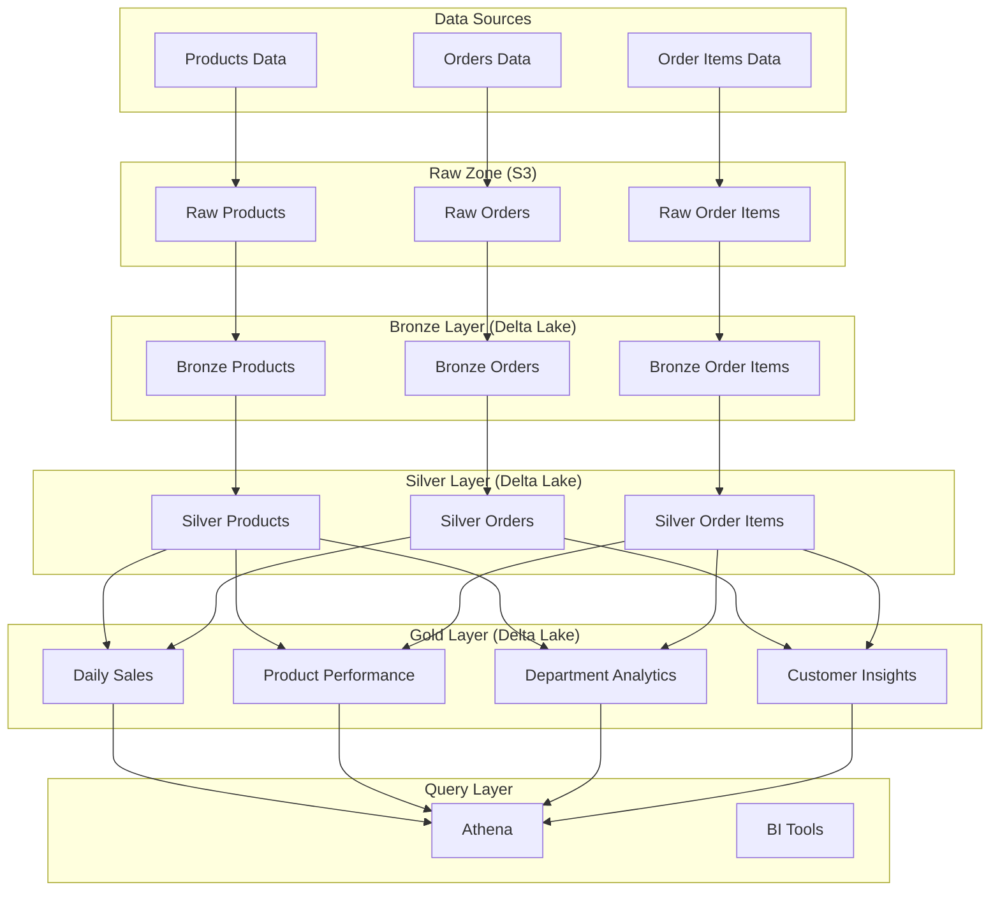

# E-Commerce Lakehouse Architecture on AWS

A production-grade Lakehouse architecture for e-commerce transaction data processing and analytics on AWS.

## Project Overview

This project implements a comprehensive Lakehouse architecture on AWS for processing e-commerce transaction data. The system ingests raw transactional data from Amazon S3, cleans and deduplicates it using Delta Lake, and exposes it for downstream analytics through Amazon Athena. The entire process is orchestrated using AWS Step Functions and automated with CI/CD on GitHub Actions.

### Key Features

- **ACID-compliant data storage** with Delta Lake
- **Multi-layer data architecture** (Bronze, Silver, Gold)
- **Automated data quality validation**
- **Comprehensive data transformations**
- **Optimized query performance** with partitioning and Z-ordering
- **Fully automated CI/CD pipeline**
- **Production-ready monitoring and alerting**

## Architecture

The architecture follows the medallion design pattern with three primary data layers:



## AWS Services Used

- **Amazon S3**: Raw and processed data storage
- **AWS Glue**: ETL processing and metadata catalog
- **Delta Lake**: ACID-compliant table format
- **AWS Step Functions**: Workflow orchestration
- **AWS Glue Data Catalog**: Metadata repository
- **Amazon Athena**: SQL query engine
- **GitHub Actions**: CI/CD pipeline

## Project Structure

```plaintext
├── data/                      # Sample data files
│   ├── products.csv           # Product catalog data
│   ├── orders_apr_2025.xlsx   # Order transaction data
│   └── order_items_apr_2025.xlsx  # Order line item data
│
├── docs/                      # Comprehensive documentation
│   ├── requirements.md        # Business requirements and service justification
│   ├── architecture.md        # Detailed architecture diagrams
│   ├── data_model.md          # Data schema and partitioning strategies
│   ├── etl_processes.md       # ETL process documentation
│   ├── data_quality.md        # Data quality framework
│   └── deployment.md          # CI/CD pipeline documentation
│
├── etl/                       # ETL scripts
│   ├── bronze/                # Bronze layer ETL jobs
│   ├── silver/                # Silver layer ETL jobs
│   └── gold/                  # Gold layer ETL jobs
│
├── infrastructure/            # Infrastructure as Code
│   ├── cloudformation/        # CloudFormation templates
│   └── terraform/             # Terraform configurations (alternative)
│
├── scripts/                   # Utility scripts
│   ├── deployment/            # Deployment scripts
│   └── validation/            # Validation scripts
│
├── tests/                     # Test suite
│   ├── unit/                  # Unit tests
│   └── integration/           # Integration tests
│
├── .github/                   # GitHub configurations
│   └── workflows/             # GitHub Actions workflows
│
├── requirements.txt           # Python dependencies
├── pyproject.toml             # Project configuration
└── README.md                  # Project overview (this file)
```

## Data Model

The data model consists of three primary datasets:

1. **Products**: Product catalog information
   - product_id, department_id, department, product_name

2. **Orders**: Order header information
   - order_num, order_id, user_id, order_timestamp, total_amount, date

3. **Order Items**: Line-item details for each order
   - id, order_id, user_id, days_since_prior_order, product_id, add_to_cart_order, reordered, order_timestamp, date

These datasets are processed through the Lakehouse architecture to enable comprehensive analytics and business intelligence.

## Getting Started

### Prerequisites

- AWS Account with appropriate permissions
- GitHub account for CI/CD
- Python 3.9+
- AWS CLI configured

### Setup

1. Clone the repository:

   ```bash
   git clone https://github.com/your-org/ecommerce-lakehouse.git
   cd ecommerce-lakehouse
   ```

2. Install dependencies:

   ```bash
   uv add -r requirements.txt
   ```

3. Configure AWS credentials:

   ```bash
   aws configure
   ```

4. Deploy the infrastructure:

   ```bash
   cd infrastructure/cloudformation
   ./deploy.sh
   ```

### Running ETL Jobs Locally

For development and testing, you can run the ETL jobs locally:

```bash
# Run Bronze layer ETL
uv run python -m etl.bronze.products_etl

# Run Silver layer ETL
uv run python -m etl.silver.products_etl

# Run Gold layer ETL
uv run python -m etl.gold.product_performance_etl
```

### Deploying to AWS

The project uses GitHub Actions for CI/CD. To deploy to AWS:

1. Push your changes to the main branch
2. GitHub Actions will automatically:
   - Run tests
   - Build artifacts
   - Deploy infrastructure
   - Update ETL jobs
   - Validate the deployment

## Documentation

Comprehensive documentation is available in the `docs/` directory:

- [Business Requirements](docs/requirements.md)
- [Architecture Design](docs/architecture.md)
- [Data Model](docs/data_model.md)
- [ETL Processes](docs/etl_processes.md)
- [Data Quality Framework](docs/data_quality.md)
- [Deployment Process](docs/deployment.md)

## Contributing

1. Fork the repository
2. Create a feature branch: `git checkout -b feature/my-feature`
3. Commit your changes: `git commit -am 'Add new feature'`
4. Push to the branch: `git push origin feature/my-feature`
5. Submit a pull request

## License

This project is licensed under the MIT License - see the LICENSE file for details.

## Acknowledgments

- AWS for providing the cloud infrastructure
- Delta Lake for the ACID-compliant table format
- The open-source community for tools and libraries
