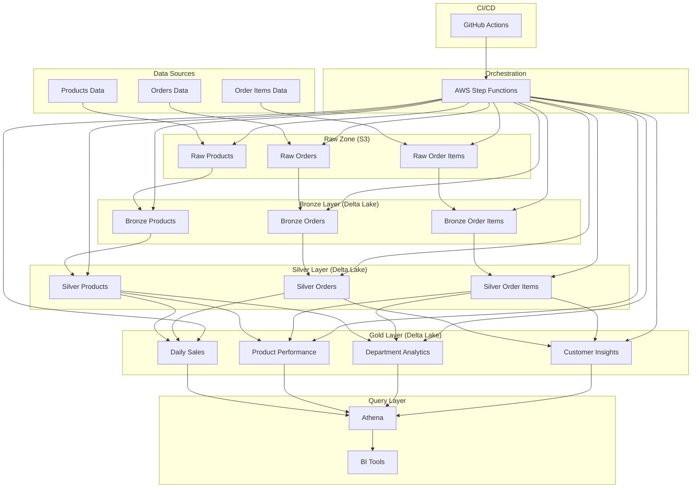
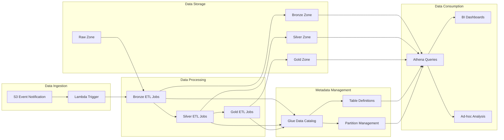
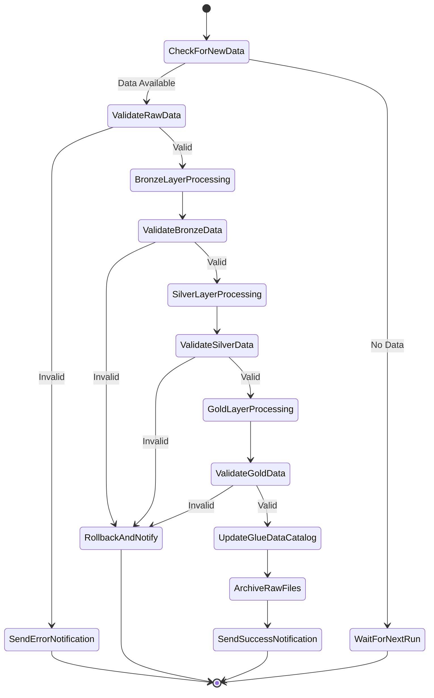
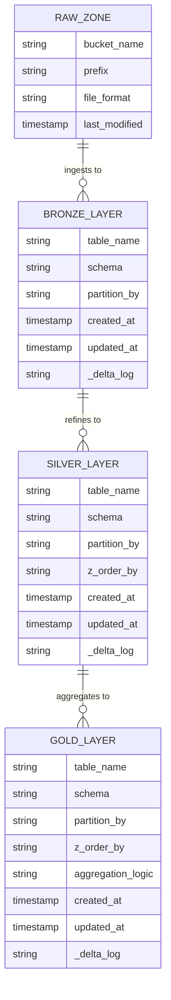
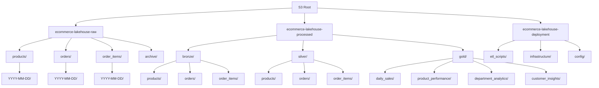
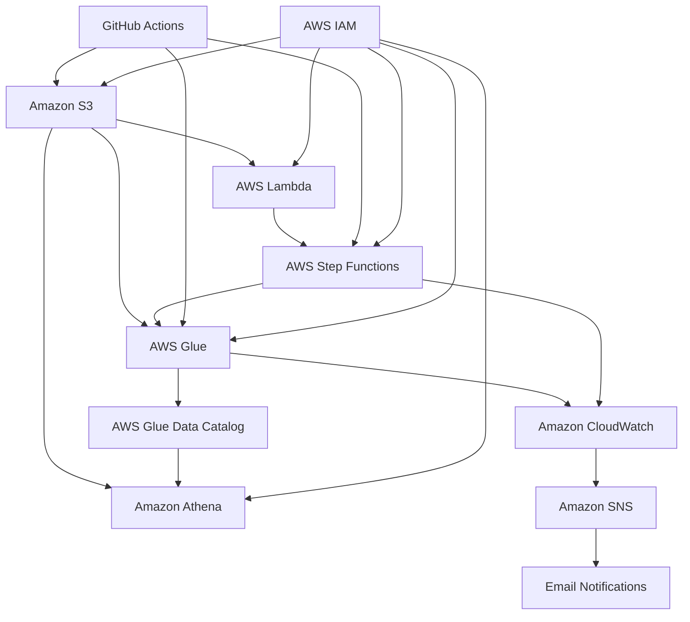

# E-Commerce Lakehouse Architecture

## Overall System Architecture

The e-commerce lakehouse architecture implements a multi-layer data processing pipeline that transforms raw data into business-ready insights through progressive refinement stages.

## Data Flow Diagram

The data flow diagram illustrates how data moves through the system, from ingestion to consumption.

## AWS Step Functions Workflow

The Step Functions workflow orchestrates the entire ETL process, handling errors and ensuring data quality at each stage.

## Delta Lake Table Structure

The Delta Lake tables are organized in a multi-layer architecture, with each layer serving a specific purpose in the data refinement process.

## S3 Bucket Structure

The S3 bucket structure organizes data by processing stage and entity type.

## AWS Service Integration

This diagram shows how the various AWS services integrate to form the complete lakehouse architecture.

