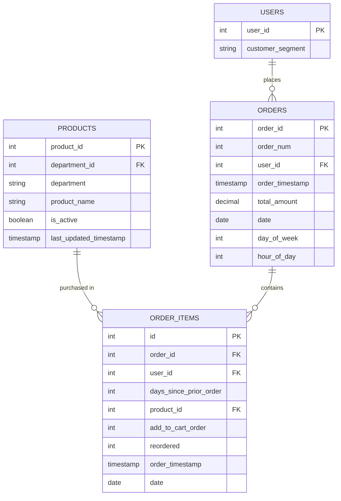

# E-Commerce Lakehouse Data Model

## Data Schema

### Source Data Schema

#### Products Data
```
- product_id: Integer (Primary Key)
- department_id: Integer (Foreign Key)
- department: String
- product_name: String
```

#### Orders Data
```
- order_num: Integer
- order_id: Integer (Primary Key)
- user_id: Integer (Foreign Key)
- order_timestamp: Timestamp
- total_amount: Decimal
- date: Date
```

#### Order Items Data
```
- id: Integer (Primary Key)
- order_id: Integer (Foreign Key to Orders)
- user_id: Integer (Foreign Key)
- days_since_prior_order: Integer
- product_id: Integer (Foreign Key to Products)
- add_to_cart_order: Integer
- reordered: Boolean/Integer (0 or 1)
- order_timestamp: Timestamp
- date: Date
```

### Bronze Layer Schema

#### Bronze Products Table
```sql
CREATE TABLE bronze.products (
    product_id INT,
    department_id INT,
    department STRING,
    product_name STRING,
    source_file STRING,
    ingestion_timestamp TIMESTAMP
)
USING DELTA;
```

#### Bronze Orders Table
```sql
CREATE TABLE bronze.orders (
    order_num INT,
    order_id INT,
    user_id INT,
    order_timestamp TIMESTAMP,
    total_amount DECIMAL(10,2),
    date DATE,
    source_file STRING,
    ingestion_timestamp TIMESTAMP
)
USING DELTA
PARTITIONED BY (date);
```

#### Bronze Order Items Table
```sql
CREATE TABLE bronze.order_items (
    id INT,
    order_id INT,
    user_id INT,
    days_since_prior_order INT,
    product_id INT,
    add_to_cart_order INT,
    reordered INT,
    order_timestamp TIMESTAMP,
    date DATE,
    source_file STRING,
    ingestion_timestamp TIMESTAMP
)
USING DELTA
PARTITIONED BY (date);
```

### Silver Layer Schema

#### Silver Products Table
```sql
CREATE TABLE silver.products (
    product_id INT,
    department_id INT,
    department STRING,
    product_name STRING,
    is_active BOOLEAN,
    last_updated_timestamp TIMESTAMP,
    source_file STRING,
    ingestion_timestamp TIMESTAMP
)
USING DELTA;
```

#### Silver Orders Table
```sql
CREATE TABLE silver.orders (
    order_id INT,
    order_num INT,
    user_id INT,
    order_timestamp TIMESTAMP,
    total_amount DECIMAL(10,2),
    date DATE,
    day_of_week INT,
    hour_of_day INT,
    source_file STRING,
    ingestion_timestamp TIMESTAMP
)
USING DELTA
PARTITIONED BY (date);
```

#### Silver Order Items Table
```sql
CREATE TABLE silver.order_items (
    id INT,
    order_id INT,
    user_id INT,
    days_since_prior_order INT,
    product_id INT,
    add_to_cart_order INT,
    reordered INT,
    order_timestamp TIMESTAMP,
    date DATE,
    source_file STRING,
    ingestion_timestamp TIMESTAMP
)
USING DELTA
PARTITIONED BY (date)
-- Z-ORDER BY (product_id, order_id); -- Applied through OPTIMIZE command
```

### Gold Layer Schema

#### Gold Daily Sales Table
```sql
CREATE TABLE gold.daily_sales (
    date DATE,
    total_sales DECIMAL(15,2),
    order_count INT,
    avg_order_value DECIMAL(10,2),
    unique_customers INT,
    total_items INT,
    avg_items_per_order DECIMAL(5,2),
    last_updated_timestamp TIMESTAMP
)
USING DELTA
PARTITIONED BY (date);
```

#### Gold Product Performance Table
```sql
CREATE TABLE gold.product_performance (
    product_id INT,
    department STRING,
    product_name STRING,
    total_quantity INT,
    total_sales DECIMAL(15,2),
    order_count INT,
    reorder_rate DECIMAL(5,4),
    avg_days_between_orders DECIMAL(5,2),
    last_updated_timestamp TIMESTAMP
)
USING DELTA
PARTITIONED BY (department);
```

#### Gold Department Analytics Table
```sql
CREATE TABLE gold.department_analytics (
    department STRING,
    total_sales DECIMAL(15,2),
    product_count INT,
    order_count INT,
    customer_count INT,
    avg_order_value DECIMAL(10,2),
    last_updated_timestamp TIMESTAMP
)
USING DELTA
PARTITIONED BY (department);
```

#### Gold Customer Insights Table
```sql
CREATE TABLE gold.customer_insights (
    user_id INT,
    total_orders INT,
    total_spend DECIMAL(15,2),
    avg_order_value DECIMAL(10,2),
    first_order_date DATE,
    last_order_date DATE,
    days_since_last_order INT,
    favorite_department STRING,
    favorite_product_id INT,
    customer_segment STRING,
    last_updated_timestamp TIMESTAMP
)
USING DELTA
PARTITIONED BY (customer_segment);
```

## Table Relationships

The following entity-relationship diagram illustrates the relationships between the tables in the Silver layer:



## Partitioning Strategies

### Bronze Layer Partitioning

| Table | Partitioning Strategy | Justification |
|-------|----------------------|---------------|
| Products | No partitioning | Small table size (1,000 records) makes partitioning unnecessary |
| Orders | Partitioned by `date` | Enables efficient time-based filtering and incremental processing |
| Order Items | Partitioned by `date` | Aligns with Orders table for join efficiency and enables time-based filtering |

### Silver Layer Partitioning

| Table | Partitioning Strategy | Z-Ordering | Justification |
|-------|----------------------|------------|---------------|
| Products | No partitioning | None | Small table size (1,000 records) makes partitioning unnecessary |
| Orders | Partitioned by `date` | None | Enables efficient time-based filtering and incremental processing |
| Order Items | Partitioned by `date` | Z-ordered by `product_id`, `order_id` | Primary partition by date aligns with Orders table; Z-ordering improves query performance for product and order-based queries |

### Gold Layer Partitioning

| Table | Partitioning Strategy | Z-Ordering | Justification |
|-------|----------------------|------------|---------------|
| Daily Sales | Partitioned by `date` | None | Natural time-series data organization |
| Product Performance | Partitioned by `department` | Z-ordered by `product_id` | Department is a common filter; Z-ordering improves product-specific queries |
| Department Analytics | Partitioned by `department` | None | Department is the primary dimension and common filter |
| Customer Insights | Partitioned by `customer_segment` | None | Enables efficient segment-based analysis and targeted marketing |

## Delta Lake Optimization

### Compaction Strategy

| Layer | Compaction Frequency | File Size Target | Justification |
|-------|---------------------|-----------------|---------------|
| Bronze | Daily | 128 MB | Balance between read performance and processing overhead |
| Silver | Daily | 256 MB | Optimized for analytical query performance |
| Gold | Weekly | 512 MB | Optimized for scan-heavy analytical workloads |

### Vacuum Policy

| Layer | Retention Period | Justification |
|-------|-----------------|---------------|
| Bronze | 7 days | Allows for recovery from recent processing errors |
| Silver | 30 days | Supports time travel for monthly reporting and analysis |
| Gold | 90 days | Enables quarterly trend analysis and comparison |

### Statistics Collection

| Layer | Statistics Collection | Justification |
|-------|----------------------|---------------|
| Bronze | Basic | Minimal overhead for raw data |
| Silver | Detailed | Supports query optimization for transformed data |
| Gold | Comprehensive | Maximizes query performance for business users |
