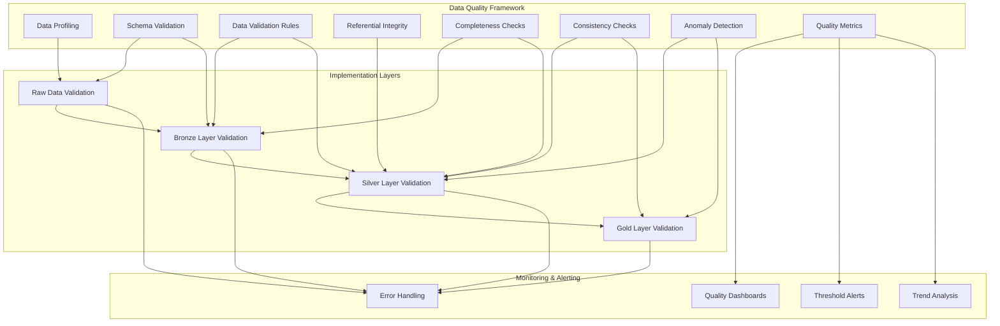
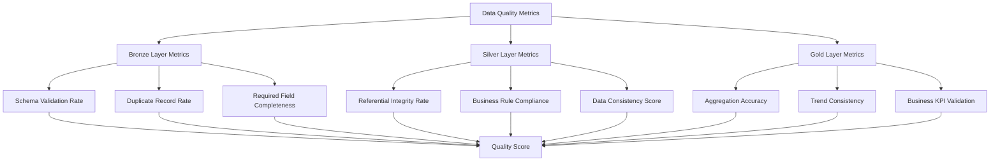
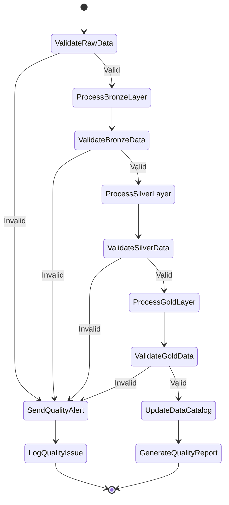

# E-Commerce Lakehouse Data Quality Framework

## Data Quality Strategy

The data quality framework for the e-commerce lakehouse architecture implements a comprehensive approach to ensuring data reliability, accuracy, and consistency across all layers of the data pipeline.



## Data Quality Checks by Layer

### Raw Data Validation

**Purpose**: Validate incoming data files before processing to ensure they meet basic structural requirements.

| Check Type | Description | Implementation |
|------------|-------------|----------------|
| File Format | Verify file format matches expected type (CSV, Excel) | File extension and MIME type validation |
| File Structure | Check for header row and expected columns | Column count and header name validation |
| File Completeness | Ensure file is not empty or truncated | Row count and file size checks |
| File Naming | Validate file naming convention | Regex pattern matching |
| Duplicate Files | Check for duplicate file ingestion | Hash comparison with previously processed files |

**Sample Implementation**:
```python
def validate_raw_file(file_path, expected_format, expected_columns):
    """
    Validate a raw data file before processing.
    
    Args:
        file_path: S3 path to the file
        expected_format: Expected file format (csv, excel)
        expected_columns: List of expected column names
    
    Returns:
        dict: Validation results with status and issues
    """
    validation_results = {"status": "PASS", "issues": []}
    
    # Check file exists
    if not file_exists(file_path):
        validation_results["status"] = "FAIL"
        validation_results["issues"].append(f"File not found: {file_path}")
        return validation_results
    
    # Check file format
    if expected_format == "csv" and not file_path.endswith(".csv"):
        validation_results["status"] = "FAIL"
        validation_results["issues"].append(f"Invalid file format. Expected CSV, got {file_path.split('.')[-1]}")
    
    # Read file header
    if expected_format == "csv":
        header = read_csv_header(file_path)
    else:
        header = read_excel_header(file_path)
    
    # Check columns
    missing_columns = [col for col in expected_columns if col not in header]
    if missing_columns:
        validation_results["status"] = "FAIL"
        validation_results["issues"].append(f"Missing expected columns: {missing_columns}")
    
    # Check file is not empty
    row_count = count_rows(file_path, expected_format)
    if row_count <= 1:  # Only header row
        validation_results["status"] = "FAIL"
        validation_results["issues"].append("File is empty (contains only header row)")
    
    return validation_results
```

### Bronze Layer Validation

**Purpose**: Ensure data loaded into the Bronze layer meets basic quality requirements while preserving the raw data.

| Check Type | Description | Implementation |
|------------|-------------|----------------|
| Schema Conformance | Verify data conforms to expected schema | Schema enforcement with Delta Lake |
| Data Type Validation | Check data types match expectations | Type casting with error handling |
| Required Fields | Ensure required fields are present | Not-null constraints |
| Duplicate Records | Identify duplicate primary keys | Distinct count vs. total count |
| Record Count | Verify all records were loaded | Compare source and target counts |

**Sample Implementation**:
```python
from pyspark.sql import SparkSession
from pyspark.sql.functions import col, count, isnan, when

def validate_bronze_layer(spark, table_name, primary_key, required_fields):
    """
    Validate data in a Bronze layer table.
    
    Args:
        spark: SparkSession
        table_name: Name of the Bronze table
        primary_key: Primary key column(s)
        required_fields: List of columns that should not be null
    
    Returns:
        dict: Validation results with metrics
    """
    df = spark.table(f"bronze.{table_name}")
    total_count = df.count()
    
    # Check for duplicate primary keys
    if isinstance(primary_key, list):
        distinct_count = df.dropDuplicates(primary_key).count()
    else:
        distinct_count = df.dropDuplicates([primary_key]).count()
    
    duplicate_count = total_count - distinct_count
    
    # Check for null required fields
    null_counts = {}
    for field in required_fields:
        null_count = df.filter(
            col(field).isNull() | 
            (when(col(field).cast("string") == "", True).otherwise(False))
        ).count()
        null_counts[field] = null_count
    
    # Prepare validation results
    validation_results = {
        "table_name": table_name,
        "total_records": total_count,
        "duplicate_primary_keys": duplicate_count,
        "null_required_fields": null_counts,
        "status": "PASS"
    }
    
    # Set status based on validation results
    if duplicate_count > 0 or any(count > 0 for count in null_counts.values()):
        validation_results["status"] = "WARN"
    
    return validation_results
```

### Silver Layer Validation

**Purpose**: Ensure data in the Silver layer is clean, consistent, and meets business rules.

| Check Type | Description | Implementation |
|------------|-------------|----------------|
| Referential Integrity | Verify foreign keys exist in reference tables | Join validation with reference tables |
| Business Rule Validation | Check data conforms to business rules | Custom validation functions |
| Value Range Validation | Ensure numeric values are within expected ranges | Min/max validation |
| Date/Time Validation | Verify date/time values are valid and in range | Date parsing and range checks |
| Consistency Checks | Ensure related data is consistent | Cross-field validation rules |
| Statistical Validation | Check for statistical anomalies | Z-score analysis for outliers |

**Sample Implementation**:
```python
from pyspark.sql import SparkSession
from pyspark.sql.functions import col, min, max, avg, stddev

def validate_silver_layer(spark, table_name, reference_checks, range_checks, consistency_checks):
    """
    Validate data in a Silver layer table.
    
    Args:
        spark: SparkSession
        table_name: Name of the Silver table
        reference_checks: Dict of {column: reference_table.column}
        range_checks: Dict of {column: (min_value, max_value)}
        consistency_checks: List of custom validation functions
    
    Returns:
        dict: Validation results with metrics
    """
    df = spark.table(f"silver.{table_name}")
    validation_results = {
        "table_name": table_name,
        "referential_integrity": {},
        "range_validations": {},
        "consistency_checks": {},
        "status": "PASS"
    }
    
    # Referential integrity checks
    for column, reference in reference_checks.items():
        ref_table, ref_column = reference.split(".")
        ref_df = spark.table(ref_table)
        
        # Count records with invalid references
        invalid_count = df.join(
            ref_df.select(ref_column),
            df[column] == ref_df[ref_column],
            "left_anti"
        ).count()
        
        validation_results["referential_integrity"][column] = {
            "invalid_references": invalid_count
        }
        
        if invalid_count > 0:
            validation_results["status"] = "WARN"
    
    # Range validations
    for column, (min_value, max_value) in range_checks.items():
        stats = df.agg(
            min(col(column)).alias("min"),
            max(col(column)).alias("max"),
            avg(col(column)).alias("avg"),
            stddev(col(column)).alias("stddev")
        ).collect()[0]
        
        out_of_range = df.filter(
            (col(column) < min_value) | (col(column) > max_value)
        ).count()
        
        validation_results["range_validations"][column] = {
            "min": stats["min"],
            "max": stats["max"],
            "avg": stats["avg"],
            "stddev": stats["stddev"],
            "out_of_range_count": out_of_range
        }
        
        if out_of_range > 0:
            validation_results["status"] = "WARN"
    
    # Consistency checks
    for i, check_func in enumerate(consistency_checks):
        check_name = check_func.__name__
        check_result = check_func(df)
        validation_results["consistency_checks"][check_name] = check_result
        
        if not check_result["passed"]:
            validation_results["status"] = "WARN"
    
    return validation_results
```

### Gold Layer Validation

**Purpose**: Validate aggregated metrics and ensure business insights are accurate and consistent.

| Check Type | Description | Implementation |
|------------|-------------|----------------|
| Aggregation Accuracy | Verify aggregations match source data | Recalculate and compare |
| Cross-Metric Consistency | Ensure related metrics are consistent | Cross-metric validation rules |
| Trend Analysis | Check for unexpected changes in trends | Time-series analysis |
| Completeness | Ensure all expected aggregations are present | Count validation by dimension |
| Business KPI Validation | Validate key business metrics | Custom business rule validation |

**Sample Implementation**:
```python
from pyspark.sql import SparkSession
from pyspark.sql.functions import sum, count, col

def validate_gold_daily_sales(spark, date_range):
    """
    Validate the gold.daily_sales table for a given date range.
    
    Args:
        spark: SparkSession
        date_range: Tuple of (start_date, end_date)
    
    Returns:
        dict: Validation results
    """
    start_date, end_date = date_range
    
    # Get gold layer data
    gold_df = spark.table("gold.daily_sales") \
        .filter(col("date").between(start_date, end_date))
    
    # Recalculate from silver layer
    silver_orders = spark.table("silver.orders") \
        .filter(col("date").between(start_date, end_date))
    
    silver_order_items = spark.table("silver.order_items") \
        .filter(col("date").between(start_date, end_date))
    
    # Recalculate metrics
    recalculated_df = silver_orders \
        .join(silver_order_items, "order_id") \
        .groupBy("date") \
        .agg(
            sum("total_amount").alias("total_sales"),
            count("order_id").alias("order_count")
        )
    
    # Compare gold metrics with recalculated metrics
    validation_results = {
        "date_range": f"{start_date} to {end_date}",
        "metrics_validation": {},
        "status": "PASS"
    }
    
    # Join gold and recalculated data
    comparison_df = gold_df \
        .join(recalculated_df, "date") \
        .select(
            "date",
            col("total_sales").alias("gold_total_sales"),
            col("order_count").alias("gold_order_count"),
            recalculated_df["total_sales"].alias("recalc_total_sales"),
            recalculated_df["order_count"].alias("recalc_order_count")
        )
    
    # Calculate differences
    for row in comparison_df.collect():
        date = row["date"]
        gold_sales = row["gold_total_sales"]
        recalc_sales = row["recalc_total_sales"]
        gold_orders = row["gold_order_count"]
        recalc_orders = row["recalc_order_count"]
        
        sales_diff = abs(gold_sales - recalc_sales)
        orders_diff = abs(gold_orders - recalc_orders)
        
        validation_results["metrics_validation"][str(date)] = {
            "total_sales_diff": sales_diff,
            "order_count_diff": orders_diff
        }
        
        # Set warning if differences exceed threshold
        if sales_diff > 0.01 or orders_diff > 0:
            validation_results["status"] = "WARN"
    
    return validation_results
```

## Data Quality Monitoring

### Quality Metrics Dashboard

The data quality framework includes a comprehensive dashboard for monitoring quality metrics across all layers of the data pipeline.



### Quality Alerting System

The alerting system monitors data quality metrics and triggers notifications when thresholds are exceeded.

| Alert Type | Trigger Condition | Notification Channel | Severity |
|------------|-------------------|---------------------|----------|
| Schema Validation Failure | Schema validation fails | Email, SNS | Critical |
| Referential Integrity Breach | >0.1% invalid references | Email, SNS | High |
| Data Completeness Issue | >1% missing required values | Email, SNS | Medium |
| Business Rule Violation | >0.5% rule violations | Email, SNS | High |
| Metric Discrepancy | >1% difference in recalculated metrics | Email, SNS | High |
| Processing Delay | Processing time exceeds SLA | Email, SNS | Medium |

**Sample Implementation**:
```python
def send_data_quality_alert(validation_results, thresholds, notification_config):
    """
    Send alerts for data quality issues.
    
    Args:
        validation_results: Results from validation checks
        thresholds: Dict of thresholds for different metrics
        notification_config: Configuration for notification channels
    """
    alerts = []
    
    # Check for schema validation failures
    if validation_results.get("schema_validation", {}).get("status") == "FAIL":
        alerts.append({
            "type": "Schema Validation Failure",
            "details": validation_results["schema_validation"].get("issues", []),
            "severity": "CRITICAL"
        })
    
    # Check for referential integrity issues
    ref_integrity = validation_results.get("referential_integrity", {})
    for column, details in ref_integrity.items():
        invalid_rate = details.get("invalid_references", 0) / validation_results.get("total_records", 1)
        if invalid_rate > thresholds.get("referential_integrity_rate", 0.001):
            alerts.append({
                "type": "Referential Integrity Breach",
                "details": f"Column {column} has {invalid_rate:.2%} invalid references",
                "severity": "HIGH"
            })
    
    # Send alerts
    if alerts:
        for alert in alerts:
            if alert["severity"] == "CRITICAL":
                send_sns_notification(
                    notification_config["critical_topic_arn"],
                    f"CRITICAL: {alert['type']}",
                    alert["details"]
                )
                send_email_notification(
                    notification_config["email_recipients"],
                    f"CRITICAL: {alert['type']}",
                    alert["details"]
                )
            elif alert["severity"] == "HIGH":
                send_sns_notification(
                    notification_config["high_topic_arn"],
                    f"HIGH: {alert['type']}",
                    alert["details"]
                )
                send_email_notification(
                    notification_config["email_recipients"],
                    f"HIGH: {alert['type']}",
                    alert["details"]
                )
```

## Data Quality Reporting

### Daily Quality Report

A daily report summarizes data quality metrics across all layers of the data pipeline.

| Report Section | Metrics | Visualization |
|----------------|---------|---------------|
| Overall Quality Score | Composite score based on all metrics | Gauge chart |
| Layer-specific Scores | Bronze, Silver, Gold layer scores | Bar chart |
| Quality Trends | 7-day trend of quality scores | Line chart |
| Issue Summary | Count of issues by severity | Pie chart |
| Detailed Issues | List of all issues with details | Table |

### Weekly Quality Review

A weekly review provides a more comprehensive analysis of data quality trends and issues.

| Review Section | Content | Purpose |
|----------------|---------|---------|
| Quality Trend Analysis | Week-over-week trends | Identify patterns and degradation |
| Issue Root Cause Analysis | Deep dive into recurring issues | Address systemic problems |
| Data Quality Improvement Plan | Action items for quality improvement | Continuous improvement |
| SLA Compliance | Processing time vs. SLA | Ensure timely data availability |
| Data Lineage Analysis | Tracing issues through the pipeline | Understand impact of issues |

## Data Quality Implementation in AWS Step Functions

The data quality checks are integrated into the AWS Step Functions workflow to ensure data quality at each stage of the pipeline.


