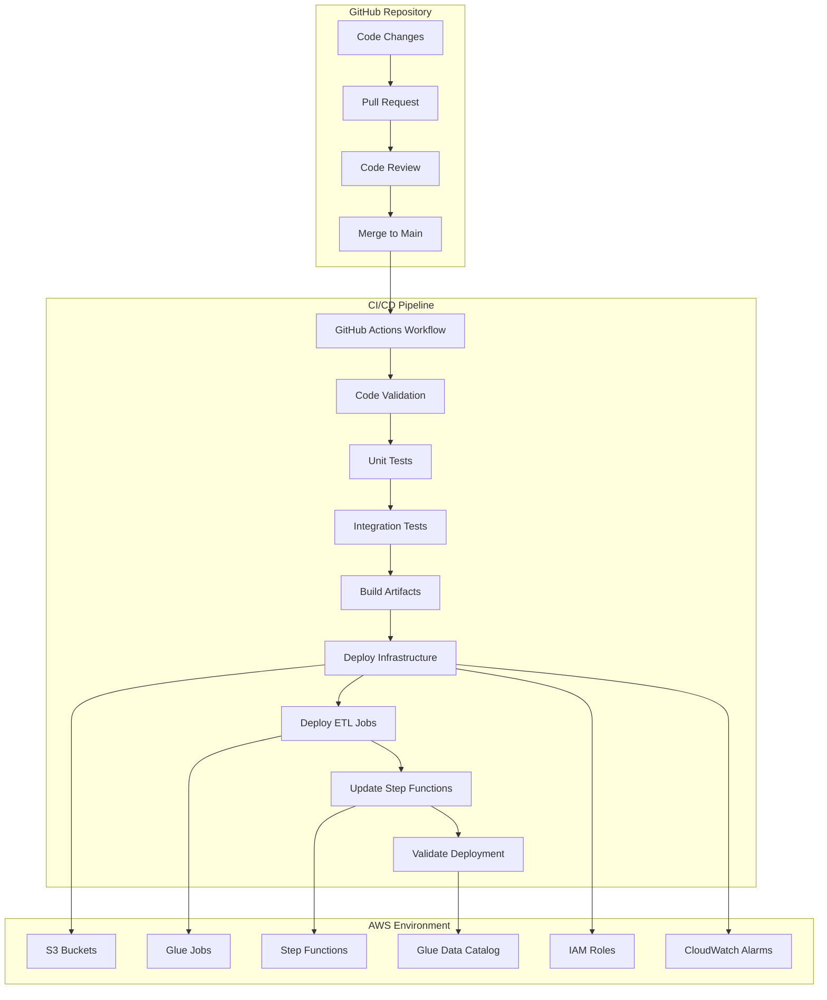
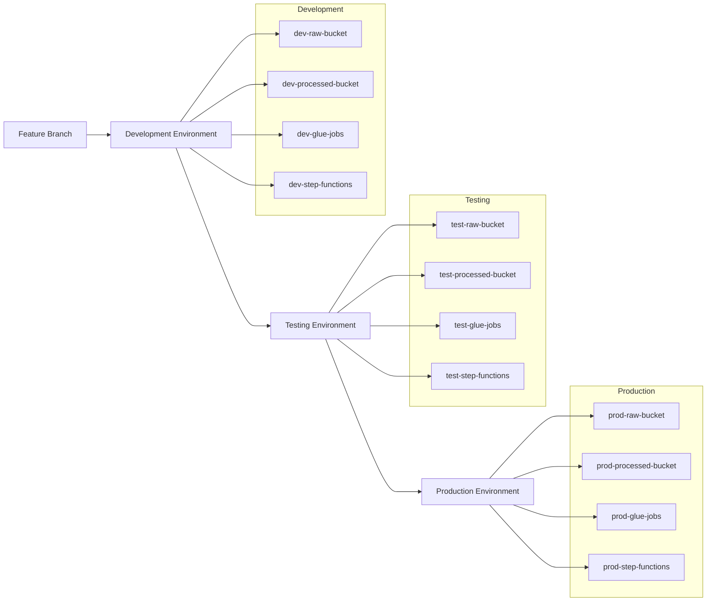

# E-Commerce Lakehouse Deployment Guide

## CI/CD Pipeline Overview

The e-commerce lakehouse architecture uses GitHub Actions for continuous integration and continuous deployment (CI/CD). This automated pipeline ensures consistent, reliable, and repeatable deployments of the entire data infrastructure.



## GitHub Actions Workflow

The CI/CD pipeline is implemented using GitHub Actions workflows defined in YAML files in the `.github/workflows` directory.

### Main Workflow

```yaml
name: E-Commerce Lakehouse CI/CD

on:
  push:
    branches: [ main ]
  pull_request:
    branches: [ main ]

jobs:
  validate:
    runs-on: ubuntu-latest
    steps:
      - name: Checkout code
        uses: actions/checkout@v2
      
      - name: Set up Python
        uses: actions/setup-python@v2
        with:
          python-version: '3.9'
      
      - name: Install dependencies
        run: |
          python -m pip install --upgrade pip
          pip install flake8 pytest pyspark delta-spark
          pip install -r requirements.txt
      
      - name: Lint with flake8
        run: flake8 . --count --select=E9,F63,F7,F82 --show-source --statistics
      
      - name: Test ETL scripts
        run: pytest tests/

  build-and-deploy:
    needs: validate
    if: github.ref == 'refs/heads/main'
    runs-on: ubuntu-latest
    steps:
      - name: Checkout code
        uses: actions/checkout@v2
      
      - name: Configure AWS credentials
        uses: aws-actions/configure-aws-credentials@v1
        with:
          aws-access-key-id: ${{ secrets.AWS_ACCESS_KEY_ID }}
          aws-secret-access-key: ${{ secrets.AWS_SECRET_ACCESS_KEY }}
          aws-region: us-east-1
      
      - name: Package ETL scripts
        run: |
          mkdir -p dist
          cp -r etl/* dist/
          zip -r etl-scripts.zip dist/
      
      - name: Deploy ETL scripts to S3
        run: |
          aws s3 cp etl-scripts.zip s3://ecommerce-lakehouse-deployment/
      
      - name: Deploy infrastructure
        uses: aws-actions/aws-cloudformation-github-deploy@v1
        with:
          name: ecommerce-lakehouse-stack
          template: infrastructure/cloudformation.yaml
          capabilities: CAPABILITY_IAM
          parameter-overrides: "Environment=prod,DeploymentBucket=ecommerce-lakehouse-deployment"
      
      - name: Update Glue jobs
        run: |
          python scripts/update_glue_jobs.py
      
      - name: Update Step Functions workflow
        run: |
          python scripts/update_step_functions.py
      
      - name: Run validation tests
        run: |
          python scripts/validate_deployment.py
```

## Infrastructure as Code

The infrastructure is defined using AWS CloudFormation templates, which are deployed as part of the CI/CD pipeline.

### CloudFormation Template Structure

```
infrastructure/
├── cloudformation.yaml       # Main template
├── s3-buckets.yaml           # S3 bucket definitions
├── glue-resources.yaml       # Glue jobs and crawlers
├── step-functions.yaml       # Step Functions workflow
├── iam-roles.yaml            # IAM roles and policies
└── monitoring.yaml           # CloudWatch alarms and dashboards
```

### Main CloudFormation Template

```yaml
AWSTemplateFormatVersion: '2010-09-09'
Description: 'E-Commerce Lakehouse Architecture'

Parameters:
  Environment:
    Type: String
    Default: dev
    AllowedValues:
      - dev
      - test
      - prod
    Description: Deployment environment

  DeploymentBucket:
    Type: String
    Description: S3 bucket containing deployment artifacts

Resources:
  # Import nested stacks
  S3Resources:
    Type: AWS::CloudFormation::Stack
    Properties:
      TemplateURL: !Sub https://s3.amazonaws.com/${DeploymentBucket}/infrastructure/s3-buckets.yaml
      Parameters:
        Environment: !Ref Environment

  IAMResources:
    Type: AWS::CloudFormation::Stack
    Properties:
      TemplateURL: !Sub https://s3.amazonaws.com/${DeploymentBucket}/infrastructure/iam-roles.yaml
      Parameters:
        Environment: !Ref Environment

  GlueResources:
    Type: AWS::CloudFormation::Stack
    Properties:
      TemplateURL: !Sub https://s3.amazonaws.com/${DeploymentBucket}/infrastructure/glue-resources.yaml
      Parameters:
        Environment: !Ref Environment
        DeploymentBucket: !Ref DeploymentBucket
      DependsOn:
        - S3Resources
        - IAMResources

  StepFunctionsResources:
    Type: AWS::CloudFormation::Stack
    Properties:
      TemplateURL: !Sub https://s3.amazonaws.com/${DeploymentBucket}/infrastructure/step-functions.yaml
      Parameters:
        Environment: !Ref Environment
      DependsOn:
        - GlueResources

  MonitoringResources:
    Type: AWS::CloudFormation::Stack
    Properties:
      TemplateURL: !Sub https://s3.amazonaws.com/${DeploymentBucket}/infrastructure/monitoring.yaml
      Parameters:
        Environment: !Ref Environment
      DependsOn:
        - StepFunctionsResources

Outputs:
  RawBucket:
    Description: Raw data bucket
    Value: !GetAtt S3Resources.Outputs.RawBucket

  ProcessedBucket:
    Description: Processed data bucket
    Value: !GetAtt S3Resources.Outputs.ProcessedBucket

  StepFunctionsArn:
    Description: Step Functions workflow ARN
    Value: !GetAtt StepFunctionsResources.Outputs.StepFunctionsArn
```

## Deployment Process

### 1. Code Changes and Pull Requests

1. Developers create feature branches from `main`
2. Code changes are made and committed
3. Pull requests are created for code review
4. Automated validation and tests run on pull requests
5. Code is reviewed and approved
6. Pull request is merged to `main`

### 2. Continuous Integration

When code is pushed to the `main` branch, the GitHub Actions workflow automatically:

1. Runs linting and code style checks
2. Executes unit tests for ETL scripts
3. Validates infrastructure templates
4. Builds deployment artifacts

### 3. Continuous Deployment

After successful validation and testing, the workflow:

1. Deploys or updates CloudFormation stacks
2. Uploads ETL scripts to S3
3. Updates Glue job definitions
4. Updates Step Functions workflow
5. Runs validation tests to ensure successful deployment

## Environment Management

The deployment pipeline supports multiple environments (development, testing, production) through parameterization.



### Environment Configuration

Environment-specific configurations are managed through parameter files:

```
config/
├── dev/
│   ├── parameters.json
│   └── secrets.json
├── test/
│   ├── parameters.json
│   └── secrets.json
└── prod/
    ├── parameters.json
    └── secrets.json
```

## Deployment Validation

After deployment, automated validation tests ensure the infrastructure and ETL processes are functioning correctly.

### Validation Tests

1. **Infrastructure Validation**
   - Verify all resources were created successfully
   - Check IAM permissions
   - Validate bucket policies

2. **ETL Job Validation**
   - Verify Glue jobs are properly configured
   - Test job execution with sample data
   - Validate output data structure

3. **End-to-End Validation**
   - Run a complete data pipeline with test data
   - Verify data flows through all layers
   - Validate final output data

## Rollback Procedures

In case of deployment failures, the pipeline includes automated rollback procedures:

1. **CloudFormation Rollback**
   - CloudFormation automatically rolls back failed stack updates
   - Previous resource state is restored

2. **ETL Script Rollback**
   - Previous versions of ETL scripts are maintained in S3
   - Rollback script restores previous version

3. **Manual Intervention**
   - Critical failures trigger notifications
   - Runbook provides manual recovery steps

## Security Considerations

### Secrets Management

Sensitive information is managed securely:

1. **GitHub Secrets**
   - AWS credentials stored as GitHub repository secrets
   - Accessed only during workflow execution

2. **AWS Secrets Manager**
   - Database credentials and API keys stored in AWS Secrets Manager
   - Accessed by Glue jobs using IAM roles

### IAM Roles and Policies

The deployment follows the principle of least privilege:

1. **Service Roles**
   - Specific roles for Glue, Step Functions, and Lambda
   - Permissions limited to required actions

2. **Cross-Account Access**
   - If using multiple AWS accounts, cross-account roles with limited permissions

## Monitoring and Alerting

The deployment includes monitoring and alerting resources:

1. **CloudWatch Dashboards**
   - ETL job performance metrics
   - Step Functions execution metrics
   - Data quality metrics

2. **CloudWatch Alarms**
   - Job failure alerts
   - Processing time thresholds
   - Data quality thresholds

3. **SNS Topics**
   - Notification channels for different alert severities
   - Integration with email and chat systems

## Deployment Schedule

The deployment pipeline supports different deployment schedules:

1. **Continuous Deployment**
   - Every merge to `main` triggers deployment to development
   - Automated promotion to testing after validation

2. **Scheduled Deployments**
   - Production deployments scheduled during maintenance windows
   - Controlled by GitHub Actions schedule triggers

## Documentation Updates

The documentation is automatically updated as part of the deployment process:

1. **Generated Documentation**
   - Data catalog documentation generated from metadata
   - API documentation generated from code

2. **Deployment History**
   - Changelog maintained for each deployment
   - Version history tracked in documentation
