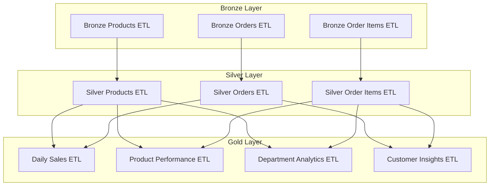
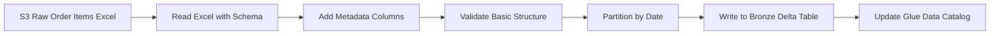
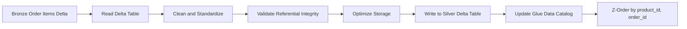
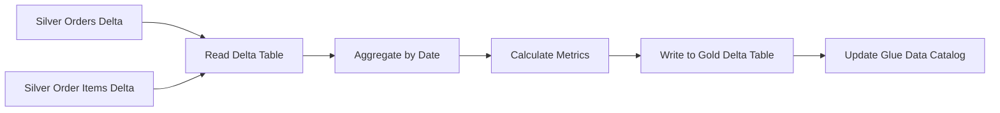
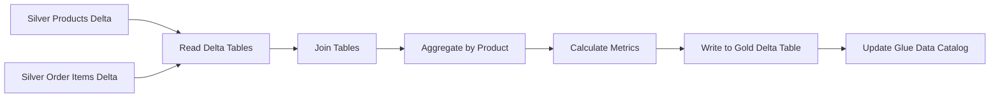
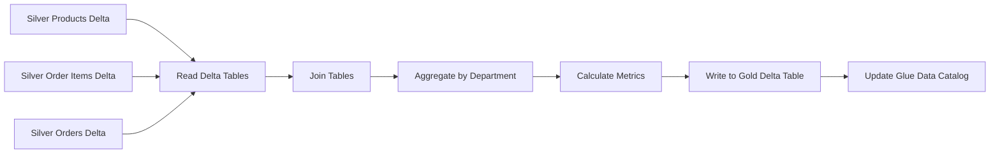
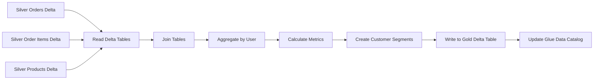

# E-Commerce Lakehouse ETL Processes

## ETL Architecture Overview

The ETL architecture follows a medallion architecture pattern with three primary layers:

1. **Bronze Layer**: Raw data ingestion with minimal processing
2. **Silver Layer**: Cleaned, validated, and transformed data
3. **Gold Layer**: Business-ready aggregated and derived data



## Bronze Layer ETL Processes

### Bronze Products ETL

**Purpose**: Ingest raw product data from CSV files into Delta Lake format with minimal transformation.

**Process Flow**:


**Key Transformations**:
- Apply schema to raw CSV data
- Add metadata columns (source_file, ingestion_timestamp)
- Convert data types to appropriate formats
- Perform basic structural validation

**Sample Code**:
```python
from pyspark.sql import SparkSession
from pyspark.sql.functions import current_timestamp, input_file_name

def process_bronze_products(spark, input_path, output_path):
    # Read raw CSV data
    products_df = spark.read.format("csv") \
        .option("header", "true") \
        .option("inferSchema", "true") \
        .load(input_path)
    
    # Add metadata columns
    products_df = products_df \
        .withColumn("source_file", input_file_name()) \
        .withColumn("ingestion_timestamp", current_timestamp())
    
    # Write to Delta table
    products_df.write.format("delta") \
        .mode("append") \
        .save(output_path)
    
    # Update Glue Data Catalog
    spark.sql(f"""
    CREATE TABLE IF NOT EXISTS bronze.products
    USING DELTA
    LOCATION '{output_path}'
    """)
```

### Bronze Orders ETL

**Purpose**: Ingest raw order data from Excel files into Delta Lake format with minimal transformation.

**Process Flow**:


**Key Transformations**:
- Convert Excel data to structured DataFrame
- Add metadata columns (source_file, ingestion_timestamp)
- Convert data types to appropriate formats
- Partition data by date
- Perform basic structural validation

**Sample Code**:
```python
from pyspark.sql import SparkSession
from pyspark.sql.functions import current_timestamp, input_file_name, to_date, col

def process_bronze_orders(spark, input_path, output_path):
    # Read raw Excel data
    orders_df = spark.read.format("com.crealytics.spark.excel") \
        .option("header", "true") \
        .option("inferSchema", "true") \
        .load(input_path)
    
    # Add metadata columns and ensure date column
    orders_df = orders_df \
        .withColumn("source_file", input_file_name()) \
        .withColumn("ingestion_timestamp", current_timestamp())
    
    # Write to Delta table with partitioning
    orders_df.write.format("delta") \
        .partitionBy("date") \
        .mode("append") \
        .save(output_path)
    
    # Update Glue Data Catalog
    spark.sql(f"""
    CREATE TABLE IF NOT EXISTS bronze.orders
    USING DELTA
    LOCATION '{output_path}'
    """)
```

### Bronze Order Items ETL

**Purpose**: Ingest raw order item data from Excel files into Delta Lake format with minimal transformation.

**Process Flow**:


**Key Transformations**:
- Convert Excel data to structured DataFrame
- Add metadata columns (source_file, ingestion_timestamp)
- Convert data types to appropriate formats
- Partition data by date
- Perform basic structural validation

**Sample Code**:
```python
from pyspark.sql import SparkSession
from pyspark.sql.functions import current_timestamp, input_file_name, to_date, col

def process_bronze_order_items(spark, input_path, output_path):
    # Read raw Excel data
    order_items_df = spark.read.format("com.crealytics.spark.excel") \
        .option("header", "true") \
        .option("inferSchema", "true") \
        .load(input_path)
    
    # Add metadata columns and ensure date column
    order_items_df = order_items_df \
        .withColumn("source_file", input_file_name()) \
        .withColumn("ingestion_timestamp", current_timestamp())
    
    # Write to Delta table with partitioning
    order_items_df.write.format("delta") \
        .partitionBy("date") \
        .mode("append") \
        .save(output_path)
    
    # Update Glue Data Catalog
    spark.sql(f"""
    CREATE TABLE IF NOT EXISTS bronze.order_items
    USING DELTA
    LOCATION '{output_path}'
    """)
```

## Silver Layer ETL Processes

### Silver Products ETL

**Purpose**: Clean, validate, and enrich product data for analytical use.

**Process Flow**:


**Key Transformations**:
- Remove duplicates based on product_id
- Standardize department names
- Validate referential integrity of department_id
- Add is_active flag for product status
- Add last_updated_timestamp for change tracking

**Sample Code**:
```python
from pyspark.sql import SparkSession
from pyspark.sql.functions import current_timestamp, col, upper, trim

def process_silver_products(spark, input_path, output_path):
    # Read bronze Delta table
    bronze_products_df = spark.read.format("delta").load(input_path)
    
    # Clean and standardize
    silver_products_df = bronze_products_df \
        .dropDuplicates(["product_id"]) \
        .withColumn("department", upper(trim(col("department")))) \
        .withColumn("is_active", lit(True)) \
        .withColumn("last_updated_timestamp", current_timestamp())
    
    # Write to Silver Delta table
    silver_products_df.write.format("delta") \
        .mode("overwrite") \
        .option("overwriteSchema", "true") \
        .save(output_path)
    
    # Update Glue Data Catalog
    spark.sql(f"""
    CREATE TABLE IF NOT EXISTS silver.products
    USING DELTA
    LOCATION '{output_path}'
    """)
```

### Silver Orders ETL

**Purpose**: Clean, validate, and enrich order data for analytical use.

**Process Flow**:


**Key Transformations**:
- Remove duplicates based on order_id
- Standardize timestamp formats
- Validate numeric ranges for total_amount
- Add day_of_week and hour_of_day derived columns
- Partition by date for query optimization

**Sample Code**:
```python
from pyspark.sql import SparkSession
from pyspark.sql.functions import current_timestamp, dayofweek, hour, col

def process_silver_orders(spark, input_path, output_path):
    # Read bronze Delta table
    bronze_orders_df = spark.read.format("delta").load(input_path)
    
    # Clean and add derived columns
    silver_orders_df = bronze_orders_df \
        .dropDuplicates(["order_id"]) \
        .filter(col("total_amount") >= 0) \
        .withColumn("day_of_week", dayofweek(col("date"))) \
        .withColumn("hour_of_day", hour(col("order_timestamp")))
    
    # Write to Silver Delta table
    silver_orders_df.write.format("delta") \
        .partitionBy("date") \
        .mode("overwrite") \
        .option("overwriteSchema", "true") \
        .save(output_path)
    
    # Update Glue Data Catalog
    spark.sql(f"""
    CREATE TABLE IF NOT EXISTS silver.orders
    USING DELTA
    LOCATION '{output_path}'
    """)
```

### Silver Order Items ETL

**Purpose**: Clean, validate, and enrich order item data for analytical use.

**Process Flow**:


**Key Transformations**:
- Remove duplicates based on id
- Validate referential integrity with orders and products
- Standardize timestamp formats
- Partition by date for query optimization
- Z-order by product_id and order_id for query performance

**Sample Code**:
```python
from pyspark.sql import SparkSession
from pyspark.sql.functions import current_timestamp, col

def process_silver_order_items(spark, input_path, output_path):
    # Read bronze Delta table
    bronze_order_items_df = spark.read.format("delta").load(input_path)
    
    # Clean and validate
    silver_order_items_df = bronze_order_items_df \
        .dropDuplicates(["id"]) \
        .join(spark.table("silver.orders").select("order_id"), "order_id", "inner") \
        .join(spark.table("silver.products").select("product_id"), "product_id", "inner")
    
    # Write to Silver Delta table
    silver_order_items_df.write.format("delta") \
        .partitionBy("date") \
        .mode("overwrite") \
        .option("overwriteSchema", "true") \
        .save(output_path)
    
    # Update Glue Data Catalog
    spark.sql(f"""
    CREATE TABLE IF NOT EXISTS silver.order_items
    USING DELTA
    LOCATION '{output_path}'
    """)
    
    # Z-order the table
    spark.sql(f"""
    OPTIMIZE silver.order_items
    ZORDER BY (product_id, order_id)
    """)
```

## Gold Layer ETL Processes

### Gold Daily Sales ETL

**Purpose**: Aggregate order data to create daily sales metrics.

**Process Flow**:


**Key Transformations**:
- Aggregate orders by date
- Calculate total sales, order count, and average order value
- Count unique customers
- Calculate total items and average items per order
- Partition by date for time-series analysis

**Sample Code**:
```python
from pyspark.sql import SparkSession
from pyspark.sql.functions import sum, count, avg, countDistinct, col

def process_gold_daily_sales(spark, orders_path, order_items_path, output_path):
    # Read silver Delta tables
    orders_df = spark.read.format("delta").load(orders_path)
    order_items_df = spark.read.format("delta").load(order_items_path)
    
    # Join and aggregate
    daily_sales_df = orders_df \
        .join(order_items_df, "order_id") \
        .groupBy("date") \
        .agg(
            sum("total_amount").alias("total_sales"),
            count("order_id").alias("order_count"),
            avg("total_amount").alias("avg_order_value"),
            countDistinct("user_id").alias("unique_customers"),
            count("id").alias("total_items"),
            (count("id") / count("order_id")).alias("avg_items_per_order")
        ) \
        .withColumn("last_updated_timestamp", current_timestamp())
    
    # Write to Gold Delta table
    daily_sales_df.write.format("delta") \
        .partitionBy("date") \
        .mode("overwrite") \
        .save(output_path)
    
    # Update Glue Data Catalog
    spark.sql(f"""
    CREATE TABLE IF NOT EXISTS gold.daily_sales
    USING DELTA
    LOCATION '{output_path}'
    """)
```

### Gold Product Performance ETL

**Purpose**: Analyze product performance metrics for business intelligence.

**Process Flow**:


**Key Transformations**:
- Join products with order items
- Aggregate by product_id and department
- Calculate total quantity, sales, and order count
- Calculate reorder rate and average days between orders
- Partition by department for departmental analysis

**Sample Code**:
```python
from pyspark.sql import SparkSession
from pyspark.sql.functions import sum, count, avg, col

def process_gold_product_performance(spark, products_path, order_items_path, output_path):
    # Read silver Delta tables
    products_df = spark.read.format("delta").load(products_path)
    order_items_df = spark.read.format("delta").load(order_items_path)
    
    # Join and aggregate
    product_performance_df = order_items_df \
        .join(products_df, "product_id") \
        .groupBy("product_id", "department", "product_name") \
        .agg(
            count("id").alias("total_quantity"),
            sum("total_amount").alias("total_sales"),
            countDistinct("order_id").alias("order_count"),
            avg(col("reordered")).alias("reorder_rate"),
            avg("days_since_prior_order").alias("avg_days_between_orders")
        ) \
        .withColumn("last_updated_timestamp", current_timestamp())
    
    # Write to Gold Delta table
    product_performance_df.write.format("delta") \
        .partitionBy("department") \
        .mode("overwrite") \
        .save(output_path)
    
    # Update Glue Data Catalog
    spark.sql(f"""
    CREATE TABLE IF NOT EXISTS gold.product_performance
    USING DELTA
    LOCATION '{output_path}'
    """)
```

### Gold Department Analytics ETL

**Purpose**: Aggregate sales data by department for business analysis.

**Process Flow**:


**Key Transformations**:
- Join products, orders, and order items
- Aggregate by department
- Calculate total sales, product count, and order count
- Count unique customers
- Calculate average order value
- Partition by department for efficient querying

**Sample Code**:
```python
from pyspark.sql import SparkSession
from pyspark.sql.functions import sum, count, countDistinct, avg, col

def process_gold_department_analytics(spark, products_path, orders_path, order_items_path, output_path):
    # Read silver Delta tables
    products_df = spark.read.format("delta").load(products_path)
    orders_df = spark.read.format("delta").load(orders_path)
    order_items_df = spark.read.format("delta").load(order_items_path)
    
    # Join and aggregate
    department_analytics_df = order_items_df \
        .join(products_df, "product_id") \
        .join(orders_df, "order_id") \
        .groupBy("department") \
        .agg(
            sum("total_amount").alias("total_sales"),
            countDistinct("product_id").alias("product_count"),
            countDistinct("order_id").alias("order_count"),
            countDistinct("user_id").alias("customer_count"),
            avg("total_amount").alias("avg_order_value")
        ) \
        .withColumn("last_updated_timestamp", current_timestamp())
    
    # Write to Gold Delta table
    department_analytics_df.write.format("delta") \
        .partitionBy("department") \
        .mode("overwrite") \
        .save(output_path)
    
    # Update Glue Data Catalog
    spark.sql(f"""
    CREATE TABLE IF NOT EXISTS gold.department_analytics
    USING DELTA
    LOCATION '{output_path}'
    """)
```

### Gold Customer Insights ETL

**Purpose**: Analyze customer behavior and create customer segments.

**Process Flow**:


**Key Transformations**:
- Join orders, order items, and products
- Aggregate by user_id
- Calculate total orders, spend, and average order value
- Determine first and last order dates
- Identify favorite department and product
- Create customer segments based on behavior
- Partition by customer segment for targeted analysis

**Sample Code**:
```python
from pyspark.sql import SparkSession
from pyspark.sql.functions import sum, count, avg, min, max, datediff, current_date, col, when

def process_gold_customer_insights(spark, orders_path, order_items_path, products_path, output_path):
    # Read silver Delta tables
    orders_df = spark.read.format("delta").load(orders_path)
    order_items_df = spark.read.format("delta").load(order_items_path)
    products_df = spark.read.format("delta").load(products_path)
    
    # Join tables
    joined_df = orders_df \
        .join(order_items_df, "order_id") \
        .join(products_df, "product_id")
    
    # Aggregate by user
    user_metrics_df = joined_df \
        .groupBy("user_id") \
        .agg(
            count(distinct("order_id")).alias("total_orders"),
            sum("total_amount").alias("total_spend"),
            avg("total_amount").alias("avg_order_value"),
            min("date").alias("first_order_date"),
            max("date").alias("last_order_date"),
            datediff(current_date(), max("date")).alias("days_since_last_order")
        )
    
    # Get favorite department and product
    from pyspark.sql.window import Window
    import pyspark.sql.functions as F
    
    window_spec = Window.partitionBy("user_id").orderBy(F.desc("product_count"))
    
    favorite_products_df = joined_df \
        .groupBy("user_id", "product_id", "department") \
        .agg(count("*").alias("product_count")) \
        .withColumn("rank", F.rank().over(window_spec)) \
        .filter(col("rank") == 1) \
        .select("user_id", "department", "product_id")
    
    # Join with user metrics
    customer_insights_df = user_metrics_df \
        .join(favorite_products_df, "user_id") \
        .withColumnRenamed("department", "favorite_department") \
        .withColumnRenamed("product_id", "favorite_product_id")
    
    # Create customer segments
    customer_insights_df = customer_insights_df \
        .withColumn("customer_segment", 
            when(col("total_orders") > 10, "Loyal")
            .when((col("total_orders") > 5) & (col("days_since_last_order") <= 30), "Active")
            .when((col("total_orders") > 1) & (col("days_since_last_order") <= 90), "Regular")
            .when(col("days_since_last_order") > 90, "Lapsed")
            .otherwise("New")
        ) \
        .withColumn("last_updated_timestamp", current_timestamp())
    
    # Write to Gold Delta table
    customer_insights_df.write.format("delta") \
        .partitionBy("customer_segment") \
        .mode("overwrite") \
        .save(output_path)
    
    # Update Glue Data Catalog
    spark.sql(f"""
    CREATE TABLE IF NOT EXISTS gold.customer_insights
    USING DELTA
    LOCATION '{output_path}'
    """)
```
