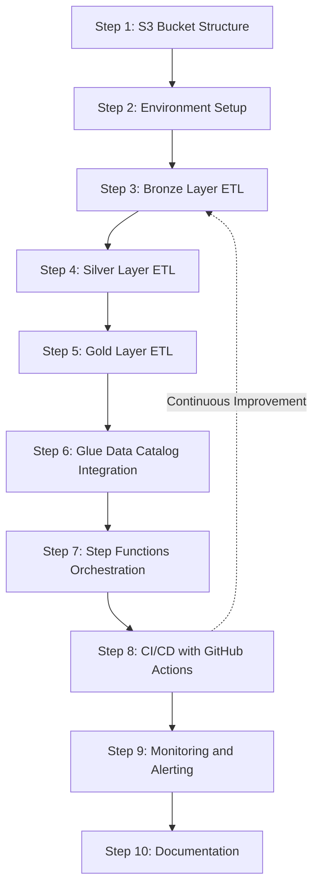

# E-Commerce Lakehouse Architecture Implementation Roadmap

This document outlines a detailed step-by-step implementation roadmap for building the e-commerce lakehouse architecture. This plan follows a logical sequence to ensure each component builds upon the previous ones.

## Step 1: S3 Bucket Structure Setup

**Objective:** Create a single S3 bucket with appropriate prefixes to store data at different processing stages.

### Implementation Details

1. **Create a single S3 bucket with the following prefix structure:**
   - `raw/` - For raw data files
     - `raw/products/` - For product data
     - `raw/orders/` - For order data
     - `raw/order_items/` - For order items data
   - `bronze/` - For Bronze layer Delta tables
     - `bronze/products/` - For Bronze products Delta table
     - `bronze/orders/` - For Bronze orders Delta table
     - `bronze/order_items/` - For Bronze order items Delta table
   - `silver/` - For Silver layer Delta tables
     - `silver/products/` - For Silver products Delta table
     - `silver/orders/` - For Silver orders Delta table
     - `silver/order_items/` - For Silver order items Delta table
   - `gold/` - For Gold layer Delta tables
     - `gold/daily_sales/` - For Gold daily sales Delta table
     - `gold/product_performance/` - For Gold product performance Delta table
     - `gold/department_analytics/` - For Gold department analytics Delta table
     - `gold/customer_insights/` - For Gold customer insights Delta table
   - `scripts/` - For ETL scripts
   - `logs/` - For execution logs

2. **Set up appropriate bucket policies:**
   - Configure lifecycle policies (archive raw data after processing)
   - Set up appropriate access controls

3. **Upload initial data to raw layer:**
   - `raw/products/products.csv`
   - `raw/orders/YYYY-MM-DD.csv` (for each date)
   - `raw/order_items/YYYY-MM-DD.csv` (for each date)

### AWS CLI Commands

```bash
# Create S3 bucket
aws s3 mb s3://ecommerce-lakehouse-{account-id}

# Upload initial data
aws s3 cp Data/products.csv s3://ecommerce-lakehouse-{account-id}/raw/products/
aws s3 cp Data/orders/ s3://ecommerce-lakehouse-{account-id}/raw/orders/ --recursive
aws s3 cp Data/order_items/ s3://ecommerce-lakehouse-{account-id}/raw/order_items/ --recursive
```

## Step 2: Environment Setup

**Objective:** Set up the development environment and project structure.

### Implementation Details

1. **Update project dependencies:**
   - Add PySpark, Delta Lake, AWS SDK, and other required libraries to pyproject.toml

2. **Create project directory structure:**
   - `etl/common/` - For shared utilities
   - `etl/bronze/` - For Bronze layer ETL scripts
   - `etl/silver/` - For Silver layer ETL scripts
   - `etl/gold/` - For Gold layer ETL scripts
   - `infrastructure/` - For CloudFormation templates
   - `.github/workflows/` - For GitHub Actions workflows

### Key Files to Create

- `etl/common/spark_session.py` - Utility to create and configure Spark session with Delta Lake
- `etl/common/s3_utils.py` - Utilities for S3 operations
- `etl/common/glue_utils.py` - Utilities for Glue Data Catalog operations

## Step 3: Bronze Layer ETL Implementation

**Objective:** Implement ETL scripts to ingest raw data into Bronze layer Delta tables.

### Implementation Details

1. **Bronze Products ETL (`etl/bronze/products_etl.py`):**
   - Read products.csv from S3 raw zone
   - Apply schema to raw CSV data
   - Add metadata columns (source_file, ingestion_timestamp)
   - Write to Bronze Delta table
   - Update Glue Data Catalog

2. **Bronze Orders ETL (`etl/bronze/orders_etl.py`):**
   - Read orders CSV files from S3 raw zone
   - Apply schema to raw CSV data
   - Add metadata columns
   - Partition by date
   - Write to Bronze Delta table
   - Update Glue Data Catalog

3. **Bronze Order Items ETL (`etl/bronze/order_items_etl.py`):**
   - Read order items CSV files from S3 raw zone
   - Apply schema to raw CSV data
   - Add metadata columns
   - Partition by date
   - Write to Bronze Delta table
   - Update Glue Data Catalog

### Dependencies

- S3 bucket structure must be set up
- Raw data must be uploaded to S3

## Step 4: Silver Layer ETL Implementation

**Objective:** Implement ETL scripts to transform Bronze layer data into Silver layer Delta tables.

### Implementation Details

1. **Silver Products ETL (`etl/silver/products_etl.py`):**
   - Read from Bronze Products Delta table
   - Clean and standardize data (remove duplicates, standardize department names)
   - Validate data quality
   - Add derived columns (is_active, last_updated_timestamp)
   - Write to Silver Delta table
   - Update Glue Data Catalog

2. **Silver Orders ETL (`etl/silver/orders_etl.py`):**
   - Read from Bronze Orders Delta table
   - Clean and standardize data
   - Validate numeric ranges for total_amount
   - Add derived columns (day_of_week, hour_of_day)
   - Partition by date
   - Write to Silver Delta table
   - Update Glue Data Catalog

3. **Silver Order Items ETL (`etl/silver/order_items_etl.py`):**
   - Read from Bronze Order Items Delta table
   - Clean and validate data
   - Ensure referential integrity with orders and products
   - Partition by date
   - Write to Silver Delta table with Z-ordering by product_id and order_id
   - Update Glue Data Catalog

### Dependencies

- Bronze layer ETL jobs must be implemented and executed
- Bronze layer Delta tables must exist in S3

## Step 5: Gold Layer ETL Implementation

**Objective:** Implement ETL scripts to transform Silver layer data into Gold layer Delta tables for analytics.

### Implementation Details

1. **Gold Daily Sales ETL (`etl/gold/daily_sales_etl.py`):**
   - Read from Silver Orders and Order Items Delta tables
   - Aggregate by date
   - Calculate metrics (total sales, order count, avg order value, etc.)
   - Write to Gold Delta table
   - Update Glue Data Catalog

2. **Gold Product Performance ETL (`etl/gold/product_performance_etl.py`):**
   - Read from Silver Products and Order Items Delta tables
   - Join and aggregate by product_id and department
   - Calculate metrics (total quantity, sales, reorder rate, etc.)
   - Partition by department
   - Write to Gold Delta table
   - Update Glue Data Catalog

3. **Gold Department Analytics ETL (`etl/gold/department_analytics_etl.py`):**
   - Read from Silver Products, Orders, and Order Items Delta tables
   - Join and aggregate by department
   - Calculate metrics (total sales, product count, customer count, etc.)
   - Partition by department
   - Write to Gold Delta table
   - Update Glue Data Catalog

4. **Gold Customer Insights ETL (`etl/gold/customer_insights_etl.py`):**
   - Read from Silver Orders, Order Items, and Products Delta tables
   - Aggregate by user_id
   - Calculate metrics and create customer segments
   - Partition by customer segment
   - Write to Gold Delta table
   - Update Glue Data Catalog

### Dependencies

- Silver layer ETL jobs must be implemented and executed
- Silver layer Delta tables must exist in S3

## Step 6: AWS Glue Data Catalog Integration

**Objective:** Configure AWS Glue Data Catalog to make Delta tables queryable through Athena.

### Implementation Details

1. **Create Glue Database:**
   - Create separate databases for bronze, silver, and gold layers

2. **Implement Glue Catalog Utilities (`etl/common/glue_catalog.py`):**
   - Functions to create/update Glue tables
   - Functions to register Delta table schemas
   - Functions to update table partitions

3. **Update ETL Scripts:**
   - Modify all ETL scripts to update Glue Data Catalog after writing Delta tables
   - Implement table registration in each ETL job

4. **Create CloudFormation Template (`infrastructure/cloudformation/glue_catalog.yaml`):**
   - Define Glue databases
   - Define IAM roles and permissions

### AWS CLI Commands

```bash
# Create Glue databases
aws glue create-database --database-input '{"Name":"bronze"}'
aws glue create-database --database-input '{"Name":"silver"}'
aws glue create-database --database-input '{"Name":"gold"}'
```

### Dependencies

- All ETL jobs must be implemented
- Delta tables must exist in S3

## Step 7: AWS Step Functions Orchestration

**Objective:** Set up AWS Step Functions to orchestrate the entire ETL workflow.

### Implementation Details

1. **Create Step Functions State Machine:**
   - Define workflow for Bronze → Silver → Gold layer processing
   - Configure parallel execution where possible
   - Implement error handling and retry logic
   - Set up event-based triggers for new data

2. **Create Lambda Functions for ETL Execution:**
   - Create Lambda functions to execute Glue jobs
   - Implement status checking and error handling

3. **Create CloudFormation Template (`infrastructure/cloudformation/step_functions.yaml`):**
   - Define Step Functions state machine
   - Define Lambda functions
   - Define IAM roles and permissions
   - Configure CloudWatch Events for triggering

4. **Implement S3 Event Notifications:**
   - Configure S3 to trigger Step Functions when new data arrives in raw zone

### Dependencies

- All ETL jobs must be implemented as Glue jobs
- Glue Data Catalog must be configured

## Step 8: CI/CD with GitHub Actions

**Objective:** Implement CI/CD pipeline using GitHub Actions for automated testing and deployment.

### Implementation Details

1. **Create GitHub Actions Workflow (`.github/workflows/ci-cd.yaml`):**
   - Define workflow for testing, building, and deploying
   - Configure AWS credentials and permissions
   - Set up environment-specific deployments (dev, staging, prod)

2. **Implement Testing:**
   - Unit tests for ETL functions
   - Integration tests for data flow
   - Validation tests for data quality

3. **Implement Deployment:**
   - Deploy CloudFormation templates
   - Update Glue jobs
   - Update Step Functions state machine

4. **Implement Validation:**
   - Validate deployment success
   - Run smoke tests after deployment
   - Send notifications on success/failure

### Dependencies

- All code must be committed to GitHub repository
- AWS credentials must be configured as GitHub secrets

## Step 9: Monitoring and Alerting

**Objective:** Set up monitoring and alerting for the ETL pipeline.

### Implementation Details

1. **Configure CloudWatch Metrics:**
   - Monitor Glue job execution times
   - Track data volumes and processing times
   - Monitor Step Functions execution status

2. **Set Up CloudWatch Alarms:**
   - Alert on job failures
   - Alert on excessive execution times
   - Alert on data quality issues

3. **Implement Data Quality Monitoring:**
   - Create data quality checks in ETL jobs
   - Log data quality metrics to CloudWatch
   - Alert on data quality violations

4. **Create CloudFormation Template (`infrastructure/cloudformation/monitoring.yaml`):**
   - Define CloudWatch metrics and alarms
   - Configure SNS topics for notifications
   - Set up dashboard for visualization

### Dependencies

- ETL pipeline must be fully implemented
- Step Functions workflow must be operational

## Step 10: Documentation and Knowledge Transfer

**Objective:** Create comprehensive documentation for the system.

### Implementation Details

1. **Update Documentation:**
   - Complete all documentation in the docs directory
   - Document AWS infrastructure setup
   - Create user guides for querying data with Athena

2. **Create Architecture Diagrams:**
   - Update architecture diagrams with actual implementation details
   - Document data flow and component interactions

3. **Create Operational Runbooks:**
   - Document operational procedures
   - Create troubleshooting guides
   - Document recovery procedures

### Dependencies

- All components must be implemented and tested

## Implementation Timeline and Dependencies

Here's a visual representation of the dependencies between components:



This implementation roadmap provides a logical sequence for building the e-commerce lakehouse architecture, with each step building upon the previous ones. The plan ensures that dependencies are met before moving to the next step, while also allowing for parallel development where possible.
